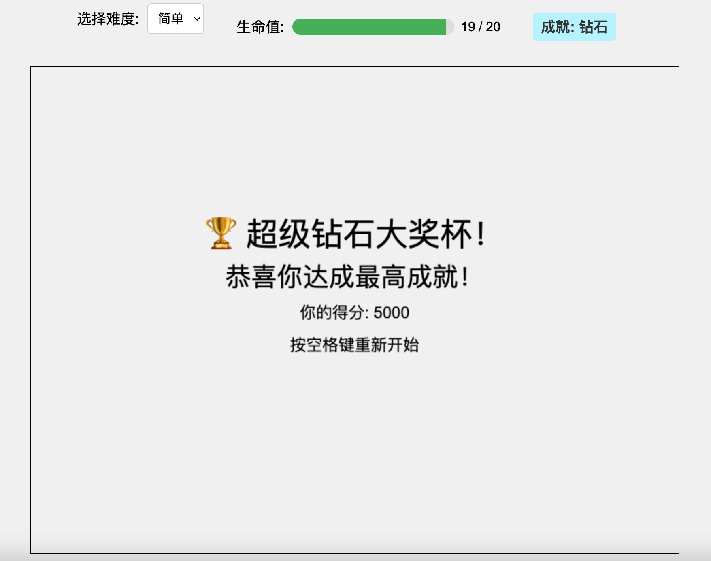

# 飞机大战游戏

这是一个简单的飞机大战游戏，使用 HTML、CSS 和 JavaScript 构建，并通过 Node.js/Express 服务器提供服务。

在线游戏地址：[planefight-ch7rt5wi3-ldw85s-projects.vercel.app](https://planefight-ch7rt5wi3-ldw85s-projects.vercel.app/)

游戏截图



## 功能特色

- 玩家控制一架飞机，可在屏幕上自由移动，不能出边界。
- 玩家可发射**散射子弹**，每次发射4-5股，发射时机带有随机性。
- 敌机从屏幕顶部出现并向下移动，速度和生成数量随难度提升。
- 敌机分为普通和大型，大型敌机出现概率随难度提升。
- 敌方战斗机可发射子弹，威胁玩家。
- 随机出现能量宝箱，玩家拾取后可获得护甲（光晕显示），护甲可叠加。
- 玩家有护甲时，碰到敌机或敌方子弹只消耗护甲，不会死亡；护甲为0时再碰撞则游戏结束。
- 子弹与敌机有碰撞检测，击中敌机可得分。
- 敌机触底（中等及以上难度）会扣分，分数低于0则游戏结束。
- 游戏包含菜单、进行中、结束三种状态。
- 支持难度选择（简单、中等、困难），影响敌机生成速度、移动速度、生命值等。
- 使用对象池优化性能（子弹池、敌机池、敌方子弹池、能量宝箱池）。

## 安装与运行

### 1. 克隆仓库

```bash
git clone https://github.com/ldw85/planefight.git
cd planefight
```

### 2. 安装依赖

确保你已安装 [Node.js](https://nodejs.org/)。

```bash
npm install
```

### 3. 启动服务器

```bash
npm start
```

默认会在 [http://localhost:3000](http://localhost:3000) 启动服务。

### 4. 打开游戏

在浏览器中访问 [http://localhost:3000](http://localhost:3000) 即可开始游戏。

## 目录结构

```
planefight/
├── image/                # 游戏图片资源
│   ├── vehicle.png       # 玩家飞机图片
│   └── jet-plane.png     # 敌机图片
├── public/               # 静态资源目录（如有）
├── game.js               # 游戏主逻辑
├── player.js             # 玩家类
├── enemy.js              # 敌机类
├── input.js              # 输入处理
├── gamestate.js          # 游戏状态管理
├── style.css             # 样式文件
├── index.html            # 游戏主页面
├── server.js             # Express服务器
├── package.json          # 项目依赖与脚本
└── README.md             # 项目说明
```

## 程序调用关系

1. **index.html**  
   - 定义游戏画布和难度选择下拉框，加载所有 JS 文件。
2. **server.js**  
   - 使用 Express 提供静态文件服务。
3. **game.js**  
   - 游戏主循环、对象池、敌人/宝箱生成、碰撞检测、状态切换等核心逻辑。
4. **player.js / enemy.js**  
   - 玩家与敌机的属性、绘制与行为。
5. **input.js**  
   - 监听键盘事件，维护输入状态。
6. **gamestate.js**  
   - 定义和管理游戏状态。

## 操作说明

- **方向键/WASD**：移动飞机
- **空格键**：发射子弹
- **数字键1/2/3**：选择难度
- **拾取能量宝箱**：获得护甲

## 许可协议

本项目采用 MIT License，详见 [LICENSE](LICENSE)。

---

如有建议或问题，欢迎提

1.  在线体验地址：https://planefight-ch7rt5wi3-ldw85s-projects.vercel.app
2.  有趣的背景：这是一个6岁孩子设计并和AI对话完成开发的游戏，在过程中由父亲提供支持。这是一个孩子学习AI编程的例子。今后我们还会开发更多的游戏。